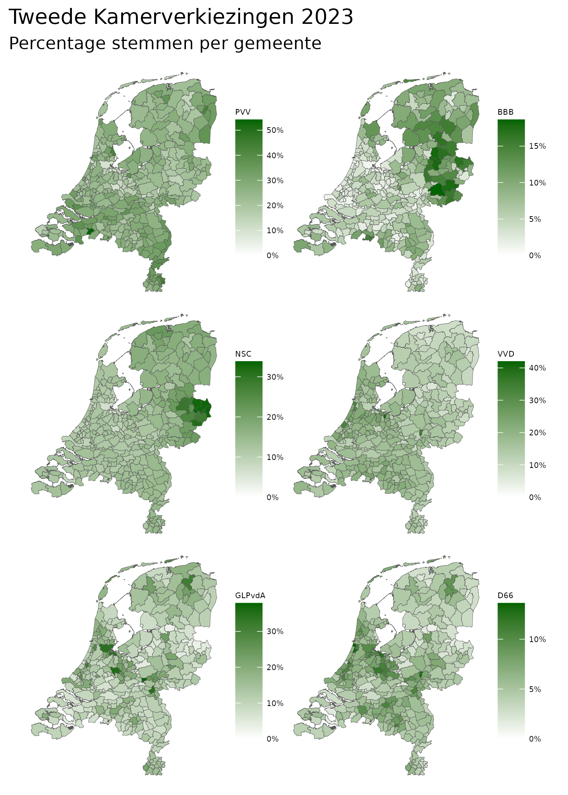
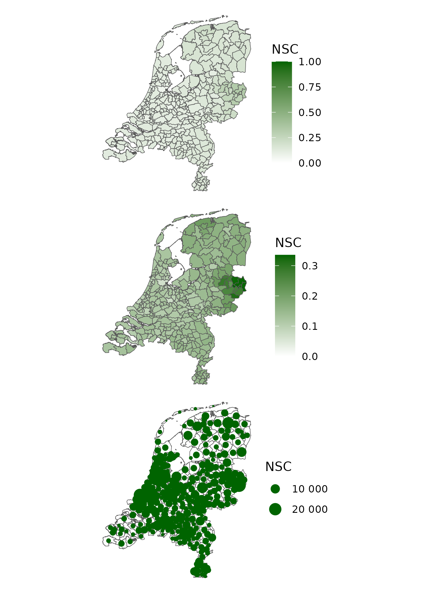

# Tweede kamerverkeizingen 22 november 2023
Op 30 november 2023 heb ik de osv4-bestanden van de kieskringen gedownload (Behalve van Kieskring Rotterdam, dat is de file van de gemeente Rotterdam). Uit deze files heb ik de stemmen per gemeente per partij geëxtraheerd. Bij het CBS heb ik een kaart met alle gemeenten in 2023 gedownload.

## Data
De files met verkiezingsuitslagen, de shape files voor de kaarten staan in de map [01_data](https://github.com/mvbloois/verkiezingen/tree/main/tk2023/01_data).

## Scripts
De scripts met functies, voor het inlezen van de data staan in [02_scripts](https://github.com/mvbloois/verkiezingen/tree/main/tk2023/02_scripts).

Er zijn twee functies:  
- Om de files van de kieskringen in te lezen  
- Om de file van de gemeente Rotterdam in te lezen  

Het script load_data.R laadt alle data in het geheugen.

`source("./tk2023/02_scripts/load_data.R`

## Output
De png files staan in de map [09_output](https://github.com/mvbloois/verkiezingen/tree/main/tk2023/09_output).

---

 ---
 
 
 

